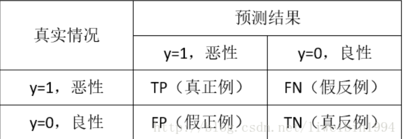
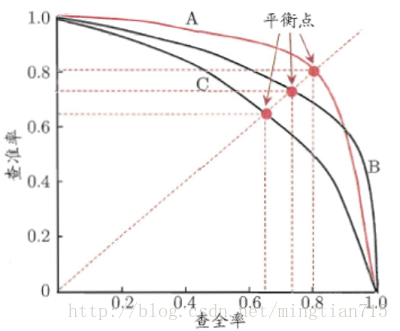
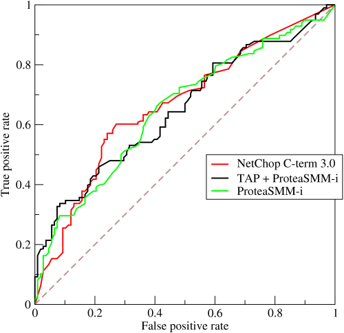
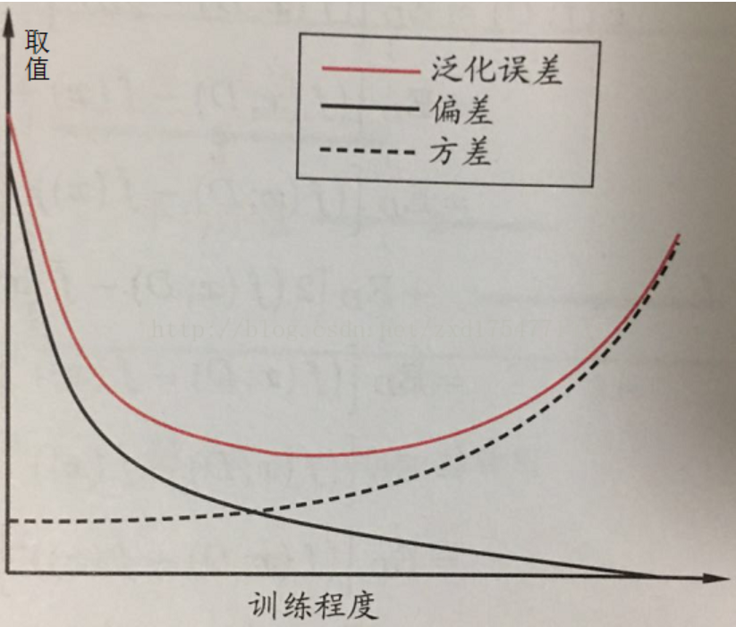

## 模型的选择和评估

### 一. 模型选择

模型选择理想的解决方案是：对候选模型的泛化误差进行评估，然后选择泛化误差最小的模型。  

&emsp;&emsp;对于分类问题，如何选择哪一个机器学习算法？如果真的在乎精度accuracy，最好的方法是通过交叉验证对各个算法进行测试比较，然后调整参数确保每个算法达到最优解，最后选择最好的一个。  

**1. 数据集大小**

偏差：描述的是预测值的期望E与真实值T之间的差距。偏差越大，越偏离真实数据。  
方差：描述的是预测值P的变化范围，离散程度，也就是离其期望值E的距离。方差越大，数据的分布越分散。   
模型的真实误差是两者之和。error = bias + variance  

如果是小训练集，高偏差/低方差的分类器(朴素贝叶斯)要优于低偏差/高方差分类器(KNN)，因为后者会过拟合。但是，当数据集增长，低偏差/高方差分类器分类器就会逐渐表现出优势(它们有较低的渐近误差).

#### 一些常见算法的优势

[**1. 朴素贝叶斯**]()

属于生成式模型，如果注有条件独立性假设，朴素贝叶斯分类器的收敛速度将快于判别模型，如逻辑回归，所以你只需要较少的训练数据即可。即使NB条件独立假设不成立，NB分类器在实践中仍然表现的很出色。它的主要缺点是它不能学习特征件的相互作用（例如，它不能学习出虽然你喜欢Brad Pitt和Tom Cruise的电影，但是你不喜欢他们在一起演的电影）。   

**优点:** 对小规模的数据表现很好，适合多分类任务，适合增量式训练。   

**缺点:** 对输入数据的表达形式很敏感。

[**2. Logistic Regression逻辑回归**]()   

属于判别式模型，有很多正则化模型的方法（L0，L1，L2, etc），而且你不必像在用朴素贝叶斯那样担心你的特征是否相关。与决策树与SVM机相比，你还会得到一个不错的概率解释，你甚至可以轻松地利用新数据来更新模型（使用在线梯度下降算法）。如果你需要一个概率架构（比如，简单地调节分类阈值，指明不确定性，或者是要获得置信区间），或者你希望以后将更多的训练数据快速整合到模型中去，那么使用它吧。   
**Sigmoid函数：** &emsp;&emsp; f(x) = 1 / (1+e<sup>-x</sup>)   

**优点：** 实现简单，广泛的应用于工业问题上；分类时计算量非常小，速度很快，存储资源低；便利的观测样本概率分数；对逻辑回归而言，多重共线性不是问题，可以结合L2正则化来解决该问题。   

**缺点：** 当特征空间很大时，逻辑回归的性能不好；容易欠拟合，一般准确率不高；不能很好的处理大量多类特征或变量；只能处理两分类问题(在此基础上衍生出的softmax可以用于多分类)，且必须线性可分；对于非线性特征，需要进行转换。

[**3. 线性回归**]()

线性回归是用于回归的，不行logistic回归是用于分类，基本思想是用梯度下降法对最小二乘法形式的误差函数进行优化，当然也可以normal equation直接求得参数的解，结果为：   
&emsp;&emsp;&emsp;&emsp;&emsp;&emsp; **w = (X<sub>T</sub>X)<sub>-1</sub>X<sub>T</sub>y**   

而在LWLR(局部加权线性回归)中，参数的计算表达式为：   
&emsp;&emsp;&emsp;&emsp;&emsp;&emsp; **w = (X<sub>T</sub>WX)<sub>-1</sub>X<sub>T</sub>Wy**  

LWLR是一个非参数模型，因为每次进行回归计算都要遍历训练样本至少一次。

**优点：** 时间简单，计算简单  

**缺点：** 不能拟合非线性数据

[**4. 最近邻算法-KNN**]()

KNN即最近邻算法，主要过程为：  
> 计算训练样本与测试样本中每个样本点的距离(常见的距离度量有欧式距离、马氏距离等)  
> 对上面所有的距离值进行排序  
> 选择前k个最小距离的样本  
> 根据这k个样本的标签进行投票，得到最后的分类类别 

如何选择一个最佳的k值取决于数据。一般情况下，在分类时较大的K值能够减小噪声的影响，但会使类别之间的界限变得模糊。一个较好的K值可通过各种启发式技术来获取，比如，交叉验证。另外噪声和非相关性特征向量的存在会使K近邻算法的准确性减小。   
近邻算法具有较强的一致性结果。随着数据趋于无限，算法保证错误率不会超过贝叶斯算法错误率的两倍。对于一些好的K值，K近邻保证错误率不会超过贝叶斯理论误差率。   

**优点：**  
> 思想简单，理论成熟，既可以用来做分类也可以用来做回归；   
> 可用于非线性分类；   
>训练时间复杂度为O(n)；   
> 准确度高，对数据没有假设，对outlier不敏感；

**缺点：**    
> 计算量大；  
> 样本不平衡问题（即有些类别的样本数量很多，而其它样本的数量很少）；  
> 需要大量的内存；

[**5. 决策树**]()

易于解释。它可以毫无压力地处理特征间的交互关系并且是非参数化的，因此你不必担心异常值或者数据是否线性可分（举个例子，决策树能轻松处理好类别A在某个特征维度x的末端，类别B在中间，然后类别A又出现在特征维度x前端的情况）。它的缺点之一就是不支持在线学习，于是在新样本到来后，决策树需要全部重建。另一个缺点就是容易出现过拟合，但这也就是诸如随机森林RF（或提升树boosted tree）之类的集成方法的切入点。另外，随机森林经常是很多分类问题的赢家（通常比支持向量机好上那么一丁点），它训练快速并且可调，同时你无须担心要像支持向量机那样调一大堆参数，所以在以前都一直很受欢迎。   
决策树中很重要的一点就是选择一个属性进行分枝，因此要注意一下信息增益的计算公式，并深入理解它。   
信息熵的计算公式如下:

<a href="http://www.codecogs.com/eqnedit.php?latex=H&space;=&space;-\sum_{i=1}^{n}p(x_{i})log_{2}p(x_{i})" target="_blank"></a>

其中的n代表有n个分类类别（比如假设是2类问题，那么n=2）。分别计算这2类样本在总样本中出现的概率p<sub>1</sub>和p<sub>2</sub>，这样就可以计算出未选中属性分枝前的信息熵。   
现在选中一个属性x<sub>i</sub>用来进行分枝，此时分枝规则是：如果x<sub>i</sub>=v的话，将样本分到树的一个分支；如果不相等则进入另一个分支。很显然，分支中的样本很有可能包括2个类别，分别计算这2个分支的熵H<sub>1</sub>和H<sub>2</sub>,计算出分枝后的总信息熵H'=p<sub>1</sub> * H<sub>1</sub>+p<sub>2</sub> * H<sub>2</sub>,则此时的信息增益ΔH = H - H'。以信息增益为原则，把所有的属性都测试一边，选择一个使增益最大的属性作为本次分枝属性。  

**优点:**  
> 计算简单，易于理解，可解释性强；  
> 比较适合处理有缺失属性值的样本；  
> 能够处理不相关的特征。

**缺点:** 容易发生过拟合（随机森林可以很大程度上减少过拟合）。

[**6. 支持向量机**]()  

高准确率，为避免过拟合提供了很好的理论保证，而且就算数据在原特征空间线性不可分，只要给个合适的核函数，它就能运行得很好。在动辄超高维的文本分类问题中特别受欢迎。可惜内存消耗大，难以解释，运行和调参也有些烦人，而随机森林却刚好避开了这些缺点，比较实用。  

**优点:**  
> 能够处理大型特征空间  
> 能够处理非线性特征的相互作用  
> 无需依赖整个数据

**缺点:**  
> 当观测样本很多时，效率并不是很高  
> 有时候很难找到一个合适的核函数

**算法选择参考：**

首当其冲应该选择的就是逻辑回归，如果它的效果不怎么样，那么可以将它的结果作为基准来参考；然后试试决策树（随机森林）是否可以大幅度提升模型性能。即使你并没有把它当做最终模型，你也可以使用随机森林来移除噪声变量；如果特征的数量和观测样本特别多，那么当资源和时间充足时，使用SVM不失为一种选择。

--------------------------------------------------------

### 二. 机器学习性能评估指标

#### 准确率Accuracy、查准率(精确率)precision、查全率(召回率)recall、F1：



查准率是针对我们**预测结果**而言的，它表示的是预测为正的样本中有多少是对的。那么预测为正就有两种可能了，一种就是把正类预测为正类(TP)，另一种就是把负类预测为正类(FP)。   
&emsp;&emsp;&emsp;&emsp; **P = TP / (TP + FP)**

而召回率是针对我们**原来的样本**而言的，它表示的是样本中的正例有多少被预测正确了。那也有两种可能，一种是把原来的正类预测成正类(TP)，另一种就是把原来的正类预测为负类(FN).   
&emsp;&emsp;&emsp;&emsp; **R = TP / (TP + FN)**

查准率和查全率是互相影响的，理想情况下是做到两者都高。但是一般情况下查准率高、查全率就低。

**如果是做搜索，那就是保证查全率的情况下提升查准率；如果是做疾病监测、反垃圾，则是保证查准率的条件下，提高查全率。两者都要求高的情况下，可以用F1来衡量。**



查准率-查全率曲线，即“P-R曲线”，进行比较学习器的性能。若一个学习器的P-R曲线完全被另一个学习器的曲线包住，则可断言后者的性能优于前者（A>C）。当两个曲线发生交叉时，通过“平衡点”（break even point），即查准率 == 查全率时的取值（A>B）。

更常用的是F1度量，基于查准率和查全率的调和平均定义。

F1的一般形式为：

<a href="https://www.codecogs.com/eqnedit.php?latex=F_{\beta&space;}=&space;\frac{(1&space;&plus;&space;\beta^2&space;)PR}{(\beta^2\ast&space;P)&plus;R}" target="_blank"></a>  

其中β>0度量了查全率对查准率的想对重要性。β = 1时为标准的F1。β>1时查全率有更大影响；β<1时查准率有更大影响。

#### ROC与AUC

ROC全称是“受试者工作特征”(Receiver Operating Characteristic)曲线，与上节中的P-R曲线相似，我们根据学习器的预测结果进行排序，按此顺序逐个把样本作为正例进行预测，每次计算两个重要量的值，分别以他们为横、纵坐标作图，就得到ROC曲线，与P-R曲线采用查准率、查全率为纵、横轴不同，ROC曲线的纵轴是“真正例率”
(True Positive Rate, TPR),横轴是“假正例率”(False Positive Rate, FPR),公式为：  
TPR = TP / (TP + FN);&emsp;&emsp;&emsp;&emsp;&emsp;&emsp;FPR = FP / (FP + TN)    



* 横坐标：1-Specificity，伪正类率(False positive rate， FPR)，**预测为正但实际为负的样本占所有负例样本的比例，**越大，负类越多   
* 纵坐标：Sensitivity，真正类率(True positive rate， TPR)，**预测为正且实际为正的样本占所有正例样本的比例，**越大，正类越多。  
* 理想目标：TPR=1，FPR=0，即图中(0,1)点，故ROC曲线越靠拢(0,1)点，越偏离45度对角线越好，Sensitivity、Specificity越大效果越好。

在一个二分类模型中，假设采用逻辑回归分类器，其给出针对每个实例为正类的概率，那么通过设定一个阈值如0.6，概率大于等于0.6的为正类，小于0.6的为负类。对应的就可以算出一组(FPR,TPR)，在平面中得到对应坐标点。随着阈值的逐渐减小，越来越多的实例被划分为正类，但是这些正类中同样也掺杂着真正的负实例，即TPR和FPR会同时增大。阈值最大时，对应坐标点为(0,0)，阈值最小时，对应坐标点(1,1)。

AUC值是一个概率值，当你随机挑选一个正样本以及一个负样本，当前的分类算法根据计算得到的Score值将这个正样本排在负样本前面的概率就是AUC值。当然，AUC值越大，当前的分类算法越有可能将正样本排在负样本前面，即能够更好的分类。

从AUC判断分类器（预测模型）优劣的标准：  
> * AUC = 1，是完美分类器，采用这个预测模型时，存在至少一个阈值能得出完美预测。绝大多数预测的场合，不存在完美分类器。  
> * 0.5 < AUC < 1，优于随机猜测。这个分类器（模型）妥善设定阈值的话，能有预测价值。   
> * AUC = 0.5，跟随机猜测一样（例：丢铜板），模型没有预测价值。   
> * AUC < 0.5，比随机猜测还差；但只要总是反预测而行，就优于随机猜测。

**PRC与ROC的比较：**

> AUC是ROC的积分（曲线下面积），是一个数值，一般认为越大越好，数值相对于曲线而言更容易当做调参的参照。  
> PR曲线会面临一个问题，当需要获得更高recall时，model需要输出更多的样本，precision可能会伴随出现下降/不变/升高，得到的曲线会出现浮动差异（出现锯齿），无法像ROC一样保证单调性。  
> 在正负样本分布得极不均匀(highly skewed datasets)的情况下，PRC比ROC能更有效地反应分类器的好坏。

```
from sklearn import metrics
y_true = [1, 1, 0, 0, 1]
y_score = [0.5, 0.6, 0.55, 0.4, 0.7 ]

fpr, tpr, thresholds = metrics.roc_curve(y_true, y_score) # 计算坐标点和阈值，大于阈值为类别1，小于阈值为类别0
auc = metrics.auc(fpr,tpr) # 计算auc值
```

----------------------------------------------------------------

### 三. 算法泛化性能：

**偏差-方差分解**是解释学习算法泛化性能的重要工具。

y<sub>D</sub>：实例x在数据集D中的标记（在实际工程中的flag（标签）列）。   
y：x的真实标记（该值是理论值，实际工程中一般是不能获得的）。   
f(x;D)：在训练集D上学得模型f，使用模型f预测x的值为f(x;D)。   
f(x)：在训练集D上学得模型f，使用模型f预测x的期望值为f(x)。即f(x) = E<sub>D</sub>[f(x;D)]  
那么，可以得到方差的公式为：Var(x) = E<sub>D</sub>[(f(x;D) – f(x))<sup>2</sup>]   
噪声的平方公式为：v<sup>2</sup> = E<sub>D</sub>[(y<sub>D</sub> - y)<sup>2</sup>]  
偏差的平方公式为：bias<sup>2</sup> (x)= (f(x) - y)<sup>2</sup>

**注：这里取噪声和偏差的平方是为了方便表达，噪声和偏差可由对应的平方公式开方而得。**

**泛化误差的公式为：E(f;D) = bias<sup>2</sup>(x) + Var + v<sup>2</sup>**

由此可见：由方差、偏差、噪声、泛化误差的公式可以看出，**偏差度量了模型预测的期望值与真实值之间的偏离程度，刻画了模型本身的拟合能力；方差度量了训练集的变动对预测结果的影响；噪声表达了能达到的期望误差的下界，刻画了学习问题本身的难度。**

方差、偏差、泛化误差之间的关系如下图所示：



-------------------------------------------------------

### 四. 损失函数

常用的损失函数分为两大类：分类和回归。分别对这两类进行细分，其中回归中包含了一种不太常见的损失函数：平均偏差误差，可以用来确定模型中存在正偏差还是负偏差。   

机器通过损失函数进行学习。这是一种评估特定算法对给定数据建模程度的方法。如果预测值与实际结果偏离较远，损失函数会得到一个非常大的值。在一些优化函数的辅助下，损失函数逐渐学会减少预测值的误差。

没有一个适合所有机器学习算法的损失函数。针对特定问题选择损失函数涉及到许多因素，比如所选机器学习算法的类型、是否易于计算导数以及数据集中异常值所占比例。

从学习任务的类型出发，可以从广义上将损失函数分为两大类——回归损失和分类损失。在分类任务中，我们要从类别值有限的数据集中预测输出，比如给定一个手写数字图像的大数据集，将其分为 0～9 中的一个。而回归问题处理的则是连续值的预测问题，例如给定房屋面积、房间数量以及房间大小，预测房屋价格。  

#### 1.回归损失

**均方误差/平方损失/L2 损失:**

<a href="https://www.codecogs.com/eqnedit.php?latex=MSE&space;=&space;\frac{\sum_{i=1}^{n}(y_i&space;-&space;\widetilde{y_i})^2}{n}" target="_blank"></a>

均方误差（MSE）度量的是预测值和实际观测值间差的平方的均值。它只考虑误差的平均大小，不考虑其方向。但由于经过平方，与真实值偏离较多的预测值会比偏离较少的预测值受到更为严重的惩罚。再加上 MSE 的数学特性很好，这使得计算梯度变得更容易。

```
import numpy as np
y_hat = np.array([0.000, 0.166, 0.333])
y_true = np.array([0.000, 0.254, 0.998])
def rmse(predictions, targets):
    differences = predictions - targets
    differences_squared = differences ** 2
    mean_of_differences_squared = differences_squared.mean()
    #rmse_val = np.sqrt(mean_of_differences_squared) # 均方根误差
    rmse_val = mean_of_differences_squared  # 均方误差
    return rmse_val
print("d is: " + str(["%.8f" % elem for elem in y_hat]))
print("p is: " + str(["%.8f" % elem for elem in y_true]))
rmse_val = rmse(y_hat, y_true)
print("rms error is: " + str(rmse_val))


#  sklearn 实现
from sklearn import metrics
mse = metrics.mean_squared_error(y_pred=y_hat,y_true=y_true)
```

**平均绝对误差/L1 损失:**

<a href="https://www.codecogs.com/eqnedit.php?latex=MAE&space;=&space;\frac{\sum_{i=1}^{n}|y_i&space;-&space;\widetilde{y_i}|}{n}" target="_blank"></a>

平均绝对误差（MAE）度量的是预测值和实际观测值之间绝对差之和的平均值。和 MSE 一样，这种度量方法也是在不考虑方向的情况下衡量误差大小。但和 MSE 的不同之处在于，MAE 需要像线性规划这样更复杂的工具来计算梯度。此外，**MAE 对异常值更加稳健，**因为它不使用平方。

```
import numpy as np
y_hat = np.array([0.000, 0.166, 0.333])
y_true = np.array([0.000, 0.254, 0.998])

def mae(predictions, targets):
    differences = predictions - targets
    absolute_differences = np.absolute(differences)
    mean_absolute_differences = absolute_differences.mean()
    return mean_absolute_differences
mae_val = mae(y_hat, y_true)
print ("mae error is: " + str(mae_val))

# sklearn
from sklearn import metrics
mae = metrics.mean_absolute_error(y_hat,y_true)
```

**平均偏差误差（mean bias error）**

<a href="https://www.codecogs.com/eqnedit.php?latex=MAE&space;=&space;\frac{\sum_{i=1}^{n}(y_i&space;-&space;\widetilde{y_i})}{n}" target="_blank"></a>

与其它损失函数相比，这个函数在机器学习领域没有那么常见。它与 MAE 相似，唯一的区别是这个函数没有用绝对值。用这个函数需要注意的一点是，正负误差可以互相抵消。尽管在实际应用中没那么准确，但它可以**确定模型存在正偏差还是负偏差**。


#### 2.分类损失

